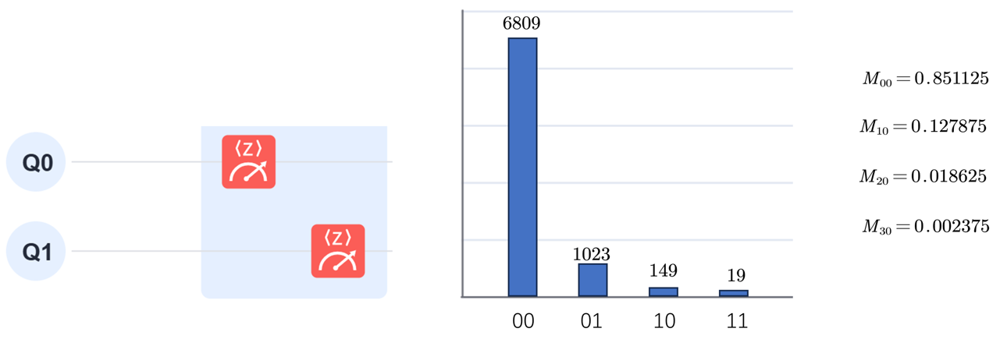
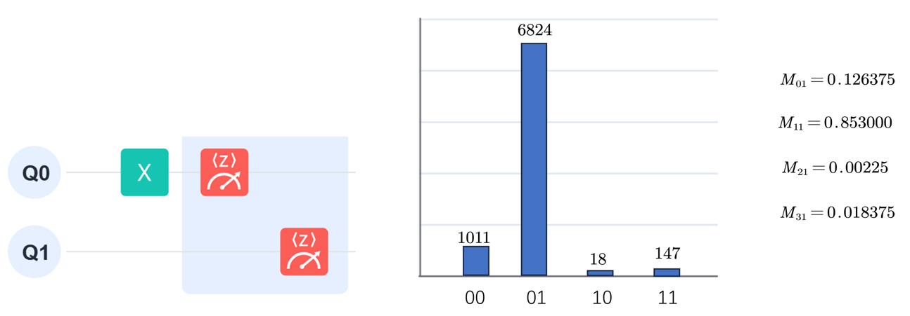
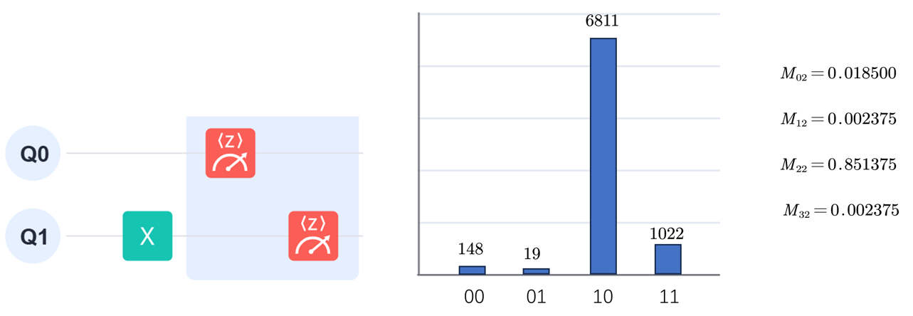
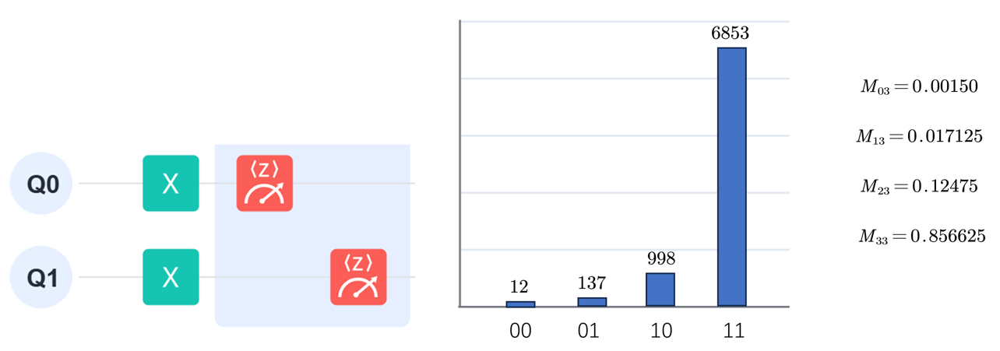

# 【赛题名称】量子测量误差缓解

在超导量子计算中，误差率的具体数值因硬件和实验条件不同而有所差异，但通常范围如下：
1．单量子门误差率：
    一般在 $10^{-4}$ 到 $10^{-3}$ 之间，即 $0.01 \%$ 到 $0.1 \%$ 。
2．双量子门误差率：
    通常在 $10^{-3}$ 到 $10^{-2}$ 之间，即 $0.1 \%$ 到 $1 \%$ 。
3．读出误差率：
    一般在 $10^{-2}$ 到 $10^{-1}$ 之间，即 $1 \%$ 到 $10 \%$ 。

可以看出量子读出噪声是造成量子错误的一个**重要来源**，当前处理读出噪声的优化技术有基于矩阵[1]、机器学习、贝叶斯估计[1]的矫正方法等。

## 【赛题说明】

给定测量得到的量子态向量 $\vec{p}_{\text {noisy }}$，设计算法求出矫正后的概率向量 $\vec{p}_\text{calibrated}$， $\vec{p}_\text{calibrated}$越接近理想分布 $\vec{p}_{\text {ideal }}$得分越高，此外，根据训练算法所用数据量给予一定奖励分数，所用数据量越少则奖励分数越高。

1. 最简单的基于矩阵的测量误差模型可以描述为： $\vec{p}_{\text {noisy }}=M \vec{p}_{\text {ideal}}$，其中$\vec{p}_{\text {ideal}}$为理想分布，$\vec{p}_{\text{noisy}}$为含误差的测量结果，即理想分布 $\vec{p}_{\text {ideal }}$经过Calibration Matrix $M$的作用得到含测量误差的分布 $\vec{p}_{\text {noisy }}$。（Calibration Matrix $M$的测量构建见附录）
2. 通常情况下，Calibration Matrix $M$ 是非奇异的，对Calibration Matrix $M$ 求逆并乘上含噪声的测量结果即可求得理想分布：$\vec{p}_{\text {ideal }}=M^{-1} \vec{p}_{\text {noisy }}$。然而，矩阵求逆方法可能会产生负值或超出概率范围的结果，这在物理上是不合理的。因此，研究人员基于该模型又发展出IBU（Iterative Bayesian Unfolding）[1, 4]等方法。
3. Calibration Matrix的维度$2^n$呈指数增长。 测量Calibration Matrix需要的“校准电路”数量也将增大，这会导致测量过程变得漫长，消耗的量子资源也会难以接受。为了迎接规模问题带来的挑战，有学者提出分而治之的方法[2, 3]。极端的分而治之容易忽略串扰（crosstalk）关联噪声（correlated noise ）等带来的量子错误。因此，需要权衡关联量子错误和规模问题。我们鼓励使用更小量子资源求解该题的方案。

## 【样例代码】

```shell
├── hackathon-readout
	├── samples
		├── circuit	# 目标线路
		├── data	# 数据集
	├── answer.py	# 赛题样例代码
	├── answer2.py	# 赛题样例代码
	├── run.py		# 判题系统的判题脚本，用于选手调试程序
	├── README.md	# 赛题说明
```

## 【数据与样例代码说明】

1. 本赛题提供9比特“基本线路”和“目标线路”测量结果作为测试数据，每个线路都进行了50000次重复实验，即每个线路都有50000个独立的9比特测量结果。
2. 基本线路共512个，具体为将比特分别制备在$\{'000000000', ~'000000001', ~'000000010',~...,~'111111111'\}$态后的测量结果，测量结果是比特排列顺序为$[q8, ~q7, ~q6, ~q5, ~q4, ~q3, ~q2, ~q1, ~q0]$的$\{0, ~1\}$比特串。以$'000000010'$态为例，即在q1上作用X门，然后测量所有比特。基本线路的测量数据在文件 `/samples/data/bitstrings_base.npz`的 `'arr_0'`中，是数据长度为 `[512, 50000, 9]`的三维数组，分别对应量子态、重复次数和不同比特。
3. 目标线路共有6个，包含1个9比特GHZ态制备线路和5个随机线路。具体量子线路的路径为：`/samples/circuit`，其中包含线路图和量子指令集两种表示形式以供参赛选手查看；测量结果在 `/samples/data/bitstrings_circuit_{i}.npz` 的 `'arr_0'`中，都是数据长度为 `[50000, 9]`的二维数组，分别对应重复次数和不同比特，比特排列顺序为$[q8, ~q7, ~q6, ~q5, ~q4, ~q3, ~q2, ~q1, ~q0]$。
4. 选手在作答时需通过样例代码 `answer.py`中的 `get_data(state, qubits_number_list, random_seed)`函数获取基本线路的测量数据，用于训练修正算法，该函数会对所用数据量进行计数，并影响最终得分，在“提交的答案”中绕过该函数获取“基本线路数据”视为作弊。
5. 选手可自由获取目标线路和测量数据用于训练修正算法，但需保证修正算法的通用性。当选手利用“目标线路的测量数据”进行预训练时，主办方会将该训练后的算法用“同一批次采集的其他量子线路测量数据”进行测试，当结果差异较大时，酌情进行减分或取消成绩。
6. `answer.py`和 `answer2.py`分别为“逆矩阵”和“IBU”方法的解答案例，供选手参考。

## 【判题与评分标准】

总分 = 基础分 + 奖励分

#### 基础分说明

$$
\begin{align}
\text{score}={1000}\times\left(1-\frac{1}{2}\sum_{i=1}^k\left|P_i-Q_i\right|    \right)
\end{align}
$$

其中

- $P_i$ 是算法得到的目标向量 $\vec{p}_{\text {a }}$中的元素，$Q_i$是理想分布 $\vec{p}_{\text {ideal }}$中的元素。
- $TVD=\frac{1}{2} \sum_{i=1}^k\left|P_i-Q_i\right|$ 的值在 0 到 1 之间，0 表示两个分布完全相同，1 表示完全不重叠。

#### 奖励分说明

$$
\begin{align}
\text{final score} = {1000} \times \left(1-\frac{1}{2}\sum_{i=1}^k\left|P_i-Q_i\right|+\alpha   \right)
\end{align}
$$

1. 用到全部“512个量子态×9比特×50000个重复结果”的，只有基础分；
2. $\alpha$ 线性负相关于bit-string数量，取值范围为 [0~0.005]，具体为：`0.005 * (50000 * 512 * 9 - train_sample_num) / 50000. / 512. / 9.`，其中 `train_sample_num`为所用基本线路测量结果的数据量，每个量子态、每个比特、每个测量结果的数据量记为1。比如获取2000个初态为’000000010‘的[q2, q1, q0]三个比特的测量结果，对应的数据量为 `2000 * 1 * 3 = 6000`。

## 【黑客松代码调试环境】

点击链接进入[JupyterLab环境](https://authoring-modelarts-cnnorth4.huaweicloud.com/console/lab?imageid=9759d934-67ab-4c5a-bd32-480287658a74)中调试代码

## 【参考文献】

[1] NACHMAN B, URBANEK M, DE JONG W A, 等. Unfolding quantum computer readout noise[J/OL]. npj Quantum Information, 2020, 6(1): 1-7. DOI:[10.1038/s41534-020-00309-7](https://doi.org/10.1038/s41534-020-00309-7).

[2] NATION P D, KANG H, SUNDARESAN N, 等. Scalable Mitigation of Measurement Errors on Quantum Computers[J/OL]. PRX Quantum, 2021, 2(4): 040326. DOI:[10.1103/PRXQuantum.2.040326](https://doi.org/10.1103/PRXQuantum.2.040326).

[3] TAN S, LU L, ZHANG H, 等. QuFEM: Fast and Accurate Quantum Readout Calibration Using the Finite Element Method[C/OL]//Proceedings of the 29th ACM International Conference on Architectural Support for Programming Languages and Operating Systems, Volume 2: 卷 2. New York, NY, USA: Association for Computing Machinery, 2024: 948-963[2024-08-05]. https://dl.acm.org/doi/10.1145/3620665.3640380. DOI:[10.1145/3620665.3640380](https://doi.org/10.1145/3620665.3640380).

[4] POKHAREL B, SRINIVASAN S, QUIROZ G, 等. Scalable measurement error mitigation via iterative bayesian unfolding[J/OL]. Physical Review Research, 2024, 6(1): 013187. DOI:[10.1103/PhysRevResearch.6.013187](https://doi.org/10.1103/PhysRevResearch.6.013187).

# 【附录】

## 【问题背景介绍】

> 我们以two qubit 为例子，介绍Quantum Readout Calibration

一个2比特的量子态可以表示为一个4维复数向量:

$$
|\psi\rangle=\left(\begin{array}{l}
\alpha \\
\beta \\
\gamma \\
\delta
\end{array}\right)
$$

计算基（computational basis）上展开该量子态

$$
|\psi\rangle=\alpha|00\rangle+\beta|01\rangle+\gamma|10\rangle+\delta|11\rangle
$$

对量子态进行测量。测量过程将量子态投影到计算基上。具体来说，测量结果与计算基的状态相关：

- 测量结果为 $|00\rangle$ 的概率为 $p_{00}=|\alpha|^2$
- 测量结果为 $|01\rangle$ 的概率为 $p_{01}=|\beta|^2$
- 测量结果为 $|10\rangle$ 的概率为 $p_{10}=|\gamma|^2$
- 测量结果为 $|11\rangle$ 的概率为 $p_{11}=|\delta|^2$

设理想的概率向量为:

$$
\vec{p}_{\text {ideal }}=\left(\begin{array}{l}
p_{00} \\
p_{01} \\
p_{10} \\
p_{11}
\end{array}\right)
$$

### 【校准矩阵（Calibration Matrix）】

理想的量子态向量，因为读出噪声（readout errors）成为带有噪声的概率向量 $\vec{p}_{\text {noisy }}$ 。我们把读出噪声对量子态的影响用 校准矩阵（Calibration Matrix）描述 $M$：

$$
\vec{p}_{\text {noisy }}=M \vec{p}_{\text {ideal }}
$$

将矩阵和向量相乘，结果为:

$$
\vec{p}_{\text {noisy }}=M\left(\begin{array}{l}
p_{00} \\
p_{01} \\
p_{10} \\
p_{11}
\end{array}\right)=\left(\begin{array}{llll}
A_{00} & B_{00} & C_{00} & D_{00} \\
A_{01} & B_{01} & C_{01} & D_{01} \\
A_{10} & B_{10} & C_{10} & D_{10} \\
A_{11} & B_{11} & C_{11} & D_{11}
\end{array}\right)\left(\begin{array}{c}
p_{00} \\
p_{01} \\
p_{10} \\
p_{11}
\end{array}\right)
$$

展开后，每个元素可以表示为:

$$
\vec{p}_{\text {noisy }}=\left(\begin{array}{c}
p_{\text {noisy }, 00} \\
p_{\text {noisy }, 01} \\
p_{\text {noisy }, 10} \\
p_{\text {noisy }, 11}
\end{array}\right)=\left(\begin{array}{c}
A_{00} p_{00}+B_{00} p_{01}+C_{00} p_{00}+D_{00} p_{00} \\
A_{01} p_{00}+B_{01} p_{01}+C_{01} p_{01}+D_{01} p_{01} \\
A_{10} p_{00}+B_{10} p_{01}+C_{10} p_{10}+D_{10} p_{10} \\
A_{11} p_{00}+B_{11} p_{01}+C_{11} p_{11}+D_{11} p_{11}
\end{array}\right)
$$

M 矩阵的形式为：

$$
M=\left(\begin{array}{cccc}
A_{00} & A_{01} & A_{10} & A_{11} \\
B_{00} & B_{01} & B_{10} & B_{11} \\
C_{00} & C_{01} & C_{10} & C_{11} \\
D_{00} & D_{01} & D_{10} & D_{11}
\end{array}\right)
$$

M 矩阵元素的含义：在该系统下从计算基 $|j\rangle$ 得到态 $|i\rangle$ 的概率。

1. 第一行:

- $A_{00}$ ：从 $|00\rangle$ 测量得到 $|00\rangle$ 的概率。
- $A_{01}$ ：从 $|01\rangle$ 测量得到 $|00\rangle$ 的概率。
- $A_{10}$ ：从 $|10\rangle$ 测量得到 $|00\rangle$ 的概率。
- $A_{11}$ ：从 $|11\rangle$ 测量得到 $|00\rangle$ 的概率。

2. 第二行:

- $B_{00}$ ：从 $|00\rangle$ 测量得到 $|01\rangle$ 的概率。
- $B_{01}$ ：从 $|01\rangle$ 测量得到 $|01\rangle$ 的概率。
- $B_{10}$ ：从 $|10\rangle$ 测量得到 $|01\rangle$ 的概率。
- $B_{11}$ ：从 $|11\rangle$ 测量得到 $|01\rangle$ 的概率。

3. 第三行:

- $C_{00}$ ：从 $|00\rangle$ 测量得到 $|10\rangle$ 的概率。
- $C_{01}$ ：从 $|01\rangle$ 测量得到 $|10\rangle$ 的概率。
- $C_{10}$ ：从 $|10\rangle$ 测量得到 $|10\rangle$ 的概率。
- $C_{11}$ ：从 $|11\rangle$ 测量得到 $|10\rangle$ 的概率。

4. 第四行:

- $D_{00}$ ：从 $|00\rangle$ 测量得到 $|11\rangle$ 的概率。
- $D_{01}$ ：从 $|01\rangle$ 测量得到 $|11\rangle$ 的概率。
- $D_{10}$ ：从 $|10\rangle$ 测量得到 $|11\rangle$ 的概率。
- $D_{11}$ ：从 $|11\rangle$ 测量得到 $|11\rangle$ 的概率。

#### 【例子】

举个例子，假设我们有以下测量误差概率:

- 从 $|00\rangle$ 到 $|00\rangle$ 的概率是 0.9，转换到 $|01\rangle$ 的概率是 0.05 ，转换到 $|10\rangle$ 的概率是 0.03，转换到 $|11\rangle$ 的概率是 0.02 。
- 从 $|01\rangle$ 到 $|00\rangle$ 的概率是 0.1，转换到 $|01\rangle$ 的概率是 0.8，转换到 $|10\rangle$ 的概率是 0.05，转换到 $|11\rangle$ 的概率是 0.05。
- 其他行可以类似定义。

最终的 M矩阵为:

$$
M=\left(\begin{array}{cccc}
0.9 & 0.1 & 0.02 & 0.01 \\
0.05 & 0.8 & 0.03 & 0.02 \\
0.03 & 0.05 & 0.9 & 0.05 \\
0.02 & 0.05 & 0.05 & 0.92
\end{array}\right)
$$

### 【指数挑战】

当系统的量子比特数目增大时，会带来以下几个主要问题：

1. Calibration Matrix的维度呈指数增长 $2^n$ 。 测量Calibration Matrix需要的“校准电路”数量也将增大，这会导致测量过程变得漫长，消耗的量子资源也会难以接受。
2. 由于M的规模呈指数增长，存储这样一个矩阵所需的内存也会迅速增加，可能会超出当前计算设备的存储能力。
3. 校准的复杂性增加。

## 【实验上如何通过测量构造Calibration Matrix】

> 前面我们假设已经知道Calibration Matrix，展示了它的影响。
>
> 现实中，Calibration Matrix需要通过实验测量得到，这部分我们展示如何从实验中获得Calibration Matrix。

测量该矩阵的方法包括构建一组称为“校准电路”的量子电路

- 对于 n 量子比特系统，我们必须构建 $2^n$ 个校准电路
- 该电路生成系统的所有相应计算基态

#### Example：2 qubits

- 2量子比特系统初始化在量子态 $|00\rangle$。
- 计算基$(|00\rangle,|01\rangle,|10\rangle,|11\rangle)$的态有$2^2$个。
- 为了构建校准矩阵，我们必须构建 $2^2$ 个校准电路，我们使用 X 门来准备这 4 个量子比特配置。
- 在读出后，我们得到每个校准电路在不同基的次数。

2量子比特系统初始化在量子态 $|00\rangle$。

- 测量得到在不同基底上的次数
- 计算相应的概率



2量子比特系统，经过线路得到量子态$|10\rangle$

- 测量得到在不同基底上的次数
- 计算相应的概率



2量子比特系统，经过线路得到量子态$|01\rangle$

- 测量得到在不同基底上的次数
- 计算相应的概率



2量子比特系统，经过线路得到量子态$|11\rangle$

- 测量得到在不同基底上的次数
- 计算相应的概率



将这些列组合成 Calibration Matrix

$$
{M}_{2 Q}=\left(\begin{array}{cccc}
\mathbf{0.851125} & 0.126375 & 0.018500 & 0.001500 \\
0.127875 & \mathbf{0.853000} & 0.002375 & 0.017125 \\
0.018625 & 0.002250 & \mathbf{0.851375} & 0.124750 \\
0.002375 & 0.018375 & 0.002375 & \mathbf{0.856625}
\end{array}\right)
$$
